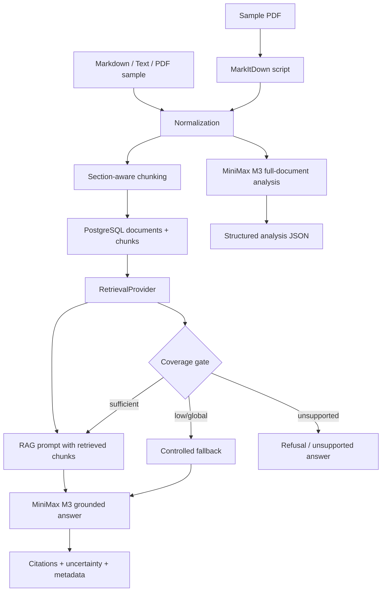

# DocuLens AI

DocuLens AI is a planned full-stack AI document assistant for a Full Stack AI Engineer assessment. The target product is an authenticated document workspace where users submit Markdown/text documents, receive structured analysis from MiniMax M3, and ask RAG-grounded questions with citations, retrieved chunk visibility, fallback metadata, and explicit uncertainty.

> Current status: this repository contains the OpenSpec change artifacts, TDD guardrails, PR delivery plan, and repository protection setup. The runnable application is intentionally not claimed as implemented yet; implementation starts with `feat/doculens-foundation`.

## Assessment strategy

```txt
RAG-first chat.
MiniMax M3 for live AI analysis and controlled fallback.
PostgreSQL as the canonical persistence target.
MarkItDown script for safe PDF-to-Markdown proof.
Tiny Terraform AWS demo, not production theater.
TDD and eval evidence over architecture claims.
```

## Planned architecture



## Core product contract

The completed app should provide:

- JWT authentication with hashed passwords and expiring tokens.
- Owner-scoped documents and child resources.
- PostgreSQL-backed documents, chunks, analyses, messages, citations, prompt metadata, fallback metadata, and token estimates.
- Markdown/text ingestion with section-aware chunking and stable chunk IDs.
- `RetrievalProvider` abstraction with pgvector/hybrid retrieval preferred.
- Labeled `lexical_fallback` only if embeddings/provider credentials block the preferred retrieval path.
- RAG-first chat where normal answers cite retrieved chunks.
- Deterministic fallback policy for low-coverage or global synthesis questions.
- Unsupported-answer behavior when the answer is not grounded in the document.
- MiniMax M3 live provider integration with budget gates and redacted logs.
- Prompt-injection resistance tested with adversarial document content.
- React UI for login, document input, analysis/chat, citations, retrieved chunks, and AI metadata.
- Eval runner covering retrieval, fallback, citations, unsupported answers, authz, prompt injection, redaction, MiniMax call/token totals, and PostgreSQL integrity.
- MarkItDown smoke path for sample PDF conversion.
- Tiny AWS demo stack with ECS Fargate, ALB, RDS PostgreSQL, Secrets Manager, CloudWatch, bounded defaults, and destroy guidance.

## What is implemented now

Implemented in this repository today:

- OpenSpec proposal, design, tasks, and capability specs.
- Public-repo `.gitignore` excluding `.env`, Terraform state/plans, local harness folders, and common secret/build artifacts.
- TDD guardrail script:

  ```txt
  scripts/guardrails/check-tdd.mjs
  ```

- Guardrail test suite:

  ```txt
  scripts/guardrails/check-tdd.test.mjs
  ```

- Local pre-commit hook:

  ```txt
  .githooks/pre-commit
  ```

- GitHub Actions workflow:

  ```txt
  .github/workflows/tdd-guardrails.yml
  ```

- Protected `main` requiring the `guardrails` status check, including for admins.

Not implemented yet:

- Runtime React app.
- Runtime Node API.
- Database migrations.
- MiniMax live provider code.
- RAG/chat endpoints.
- Playwright E2E flow.
- MarkItDown conversion script.
- Terraform AWS demo stack.

Those are tracked under the OpenSpec task plan.

## OpenSpec artifacts

Main change:

```txt
openspec/changes/build-doculens-ai-assessment/
```

Key files:

```txt
openspec/changes/build-doculens-ai-assessment/proposal.md
openspec/changes/build-doculens-ai-assessment/design.md
openspec/changes/build-doculens-ai-assessment/tasks.md
openspec/changes/build-doculens-ai-assessment/specs/document-ai-assistant/spec.md
openspec/changes/build-doculens-ai-assessment/specs/ai-reliability-evals/spec.md
openspec/changes/build-doculens-ai-assessment/specs/aws-demo-infrastructure/spec.md
```

Validate the OpenSpec change:

```bash
openspec validate --changes build-doculens-ai-assessment
```

Expected current result:

```txt
✓ change/build-doculens-ai-assessment
Totals: 1 passed, 0 failed
```

## TDD guardrails

This repository intentionally blocks implementation changes without test evidence.

Local hook setup:

```bash
git config core.hooksPath .githooks
```

Run the hook manually:

```bash
.githooks/pre-commit
```

Run guardrail tests:

```bash
node --test scripts/guardrails/check-tdd.test.mjs
```

Check staged changes:

```bash
node scripts/guardrails/check-tdd.mjs --staged
```

Check a PR/range:

```bash
node scripts/guardrails/check-tdd.mjs --range origin/main...HEAD
```

Guardrail rule:

```txt
Implementation change -> same commit/PR must include unit, integration, eval, E2E, or smoke proof.
Terraform change -> same commit/PR must include Terraform validation/test proof.
Docs/OpenSpec-only changes are allowed without test companions.
```

Important limitation: Git can verify the final diff, not the developer's mental order. The enforced workflow is therefore:

```txt
1. Write failing check locally.
2. Observe red.
3. Implement the smallest passing behavior.
4. Observe green.
5. Commit test + implementation together.
```

## PR delivery plan

Implementation should be delivered by vertical PRs, not one PR per checkbox.

| PR | Branch | Scope |
| --- | --- | --- |
| 0 | `main` | TDD guardrails, CI, branch protection |
| 1 | `feat/doculens-foundation` | App scaffold, PostgreSQL contract, env/secrets contract, schema, migrations, seed, test scripts |
| 2 | `feat/doculens-auth` | Registration/login, JWT middleware, owner-scoped documents, child-resource authz, seeded users/documents |
| 3 | `feat/doculens-ingestion` | Markdown normalization, section-aware chunking, chunk persistence, PostgreSQL integrity |
| 4 | `feat/doculens-retrieval` | `RetrievalProvider`, pgvector/hybrid preferred target, labeled lexical fallback, coverage/fallback metadata |
| 5 | `feat/doculens-minimax` | `AIProvider`, `MiniMaxProvider`, prompt IDs/versions, prompt safety, redaction, live-call budget gates |
| 6 | `feat/doculens-chat-api` | Full-document analysis, RAG chat, citation validation, unsupported answers, fallback path, prompt-injection resistance |
| 7 | `feat/doculens-ui` | Login, document input, analysis/chat views, citations, retrieved chunks, AI metadata, canonical `data-testid` E2E path |
| 8 | `feat/doculens-eval` | Eval runner and security/reliability proof gaps |
| 9 | `feat/doculens-markitdown` | MarkItDown sample conversion script and smoke check |
| 10 | `feat/doculens-aws-demo` | Docker/container path, ALB health, Terraform ECS/RDS/Secrets/CloudWatch, bounded defaults, destroy guidance |
| 11 | `docs/doculens-final-readme` | Final README, verification evidence, production gaps, data/cost/rate/AWS/MiniMax disclosures |

Do not open schema-only, interface-only, type-only, UI skeleton-only, Terraform-variable-only, or README-claim-only PRs unless they include the behavior and verification that make the change reviewable.

## Planned local commands

These commands are planned implementation deliverables. They are not claimed to work until the relevant PRs land.

```bash
npm run db:reset
npm run demo:seed
npm run dev
npm run test:unit
npm run test:integration
npm run test:e2e
npm run test:markitdown
AI_PROVIDER=minimax npm run eval
npm run verify
```

## Planned MiniMax configuration

Runtime implementation will use placeholders only in committed files.

Expected environment variables:

```bash
AI_PROVIDER=minimax
MINIMAX_API_KEY=<provided-out-of-band>
MINIMAX_BASE_URL=<provider-base-url>
MINIMAX_MODEL=MiniMax-M3
JWT_SECRET=<strong-local-secret>
DATABASE_URL=postgresql://...
```

Rules:

- Never commit real API keys.
- Never commit `.env`.
- `.env.example` must contain placeholders only.
- Logs must redact API keys, JWTs, database URLs/passwords, authorization headers, raw document text, full prompts, provider responses, and stack traces that include sensitive values.
- Live MiniMax mode must disclose that document content is sent to a third-party provider.
- Demo inputs should be non-sensitive.

## Planned AWS demo scope

The AWS deliverable is intentionally tiny and disposable:

- One app container.
- ECS Fargate service.
- Public HTTP ALB.
- RDS PostgreSQL.
- Secrets Manager references/containers.
- CloudWatch logs.
- Least-necessary security groups.
- Bounded defaults: desired count 1, small Fargate size, single-AZ small RDS, no NAT gateway, deletion protection disabled, final snapshot skipped.

Validation target:

```bash
terraform -chdir=infra/aws fmt -check
terraform -chdir=infra/aws validate
```

Optional demo-account flow:

```bash
terraform -chdir=infra/aws apply
curl <alb-health-url>/health
terraform -chdir=infra/aws destroy
```

Production gaps must remain explicit: this stack is not production-ready infrastructure.

## Repository safety

This is a public repository. Do not commit:

```txt
.env
.env.*
*.tfstate
*.tfplan
.terraform/
API keys
JWT secrets
database passwords
AWS credentials
private keys
raw sensitive document samples
local harness folders
```

The current `.gitignore` excludes known high-risk local files and generated artifacts. GitHub branch protection requires the `guardrails` check on `main`.

## Final target

The final submission should prove the app with evidence, not claims:

```txt
local setup works
PostgreSQL migrations and seed work
authz blocks cross-user access
documents chunk correctly
retrieval returns visible top-k chunks
RAG answers cite retrieved chunks
unsupported questions refuse
fallback is explicit and auditable
MiniMax live smoke validates response shape and metadata
secrets and document text are redacted from logs
evals print concise pass/fail output and fail closed
Playwright proves the main user flow
MarkItDown converts a sample PDF into chunkable Markdown
Terraform validates and documents apply/destroy/cost boundaries
README matches observed behavior
```
